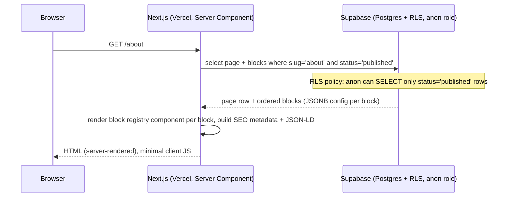
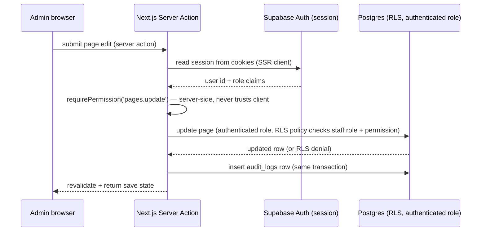

# hostmap — Architecture Overview

## What this is

A production-grade hosting-company platform: CMS-managed public marketing
site, admin dashboard, and (in later phases) a WHMCS-style client portal with
billing, domains, and support. The full target scope is defined in the
project's master build prompt (100 sections covering CMS, commerce, support,
SEO, security, etc.). That scope is a multi-month build; this document set
defines the architecture for the whole thing and is explicit about what's
implemented now vs. deferred — see [ROADMAP.md](./ROADMAP.md).

## Relationship to `dohost` and `nextdash` (documented conflict)

Two sibling repositories in the same GitHub org (`LT-MJ`) already implement
closely related products against a Supabase Postgres instance:

- **`dohost` ("HostPanel")** — a Phase-1-complete hosting/domain/billing/
  client-management platform: staff+client auth/RBAC, versioned product
  catalog, orders/invoices with explicit state machines, audit logging,
  admin + client portals. Its domain-model *decisions* (see below) are
  strong prior art from the same problem space.
- **`nextdash`** — a generic CMS/e-commerce/SEO "site builder," unrelated in
  product scope.

Both are built on **Prisma + Auth.js (next-auth) v5 + BullMQ/Redis**, connect
to Postgres via a direct connection string (not `supabase-js`), and do not
use Supabase Auth or RLS as an authorization boundary. That stack directly
conflicts with this project's hard requirements: Supabase Auth, **RLS as the
critical, primary authorization boundary** (§7 of the spec), and a
serverless-only architecture with no persistent worker process (§10–11). A
BullMQ worker is exactly the "permanent background worker" §10 rules out.

**Decision (confirmed with the user):** hostmap is a fresh, Supabase-native
build — its own dedicated Supabase project (`hostmap`, created once a free
project slot is available in the `LT-MJ` org), its own Vercel project, no
shared schema with `dohost`/`nextdash`. We reuse `dohost`'s well-reasoned
*design decisions* — translated to this stack — rather than any of its code:

| dohost decision | hostmap equivalent |
| --- | --- |
| Money as `{amount: integer minor units, currency}`, never float | Same representation, `numeric`/`bigint` columns, shared `packages`-equivalent `lib/money` module |
| Explicit state-machine transition maps + `StatusHistory` row per transition | Same pattern, enforced in Postgres via `CHECK` constraints + a `status_history` table, not just app code |
| Every business-sensitive mutation writes an `AuditLog` row in the same transaction | Same, via `audit_logs` table + Postgres trigger or transactional server action |
| RBAC permission-string catalog (`pages.view`, `orders.manage`, ...) | Same catalog, enforced via RLS policies *and* a server-side `requirePermission()` helper (defense in depth, not either/or) |
| Domain logic lives in `packages/*`, never in route handlers/components | Same separation, expressed as `src/lib/domain/*` modules in one app (see directory structure below) — no monorepo needed since there's no separate worker process to justify one |
| "Don't fake an unconfigured integration" (manual fallback, e.g. `markInvoicePaidManually`) | Same principle, applied throughout |

## Stack

- **Next.js** (App Router, current stable — pinned once dependency research
  finishes; see `docs/architecture/notes/framework-research.md` once added),
  React, TypeScript (strict), Server Components by default.
- **Tailwind CSS** + **shadcn/ui** for the component system.
- **Supabase**: Postgres (schema via versioned SQL migrations), Supabase
  Auth (email/password to start), Supabase Storage (media).
- **Vercel**: hosting, serverless/edge functions, Vercel Cron for scheduled
  jobs (sitemap regeneration, scheduled publish, reminder emails — all
  idempotent; no `setTimeout`-based fake async work, no long-running
  workers).
- **Zod** for shared validation schemas (client + server).
- **Vitest** (unit) + **Playwright** (E2E) + a small pgTAP-or-SQL-based RLS
  test suite.

## Why one Next.js app, not a monorepo

dohost uses a pnpm/Turborepo monorepo (`apps/web`, `apps/worker`,
`packages/*`) because it has a genuinely separate deployable — the BullMQ
worker. hostmap has no persistent worker (forbidden by §10), so the
`apps/worker` half of that structure doesn't apply. The `packages/*` half
(separating domain logic from UI) is still the right call, but it doesn't
require actual package boundaries — a single Next.js app with an internally
enforced `src/lib/domain/*` layer gets the same separation with one
`package.json`, one Vercel project, and no workspace-linking overhead. This
is a deliberate simplification, revisited if hostmap ever needs a second
deployable.

## Directory structure

```
hostmap/
  docs/
    architecture/          this document set
  supabase/
    migrations/             versioned SQL migrations (source of truth for schema)
    seed.sql                 or a TS seed script — see 06-testing.md
  src/
    app/
      (public)/              public marketing site — SSR/ISR, no auth required
        layout.tsx            header/footer sourced from nav + site_settings
        page.tsx               homepage (renders CMS blocks)
        [slug]/page.tsx        generic CMS page route
        blog/
          page.tsx              listing
          [slug]/page.tsx        single post
        sitemap.ts, robots.ts   generated from published content
      (admin)/
        admin/
          layout.tsx            sidebar/topbar shell, staff-only guard
          page.tsx               dashboard (real queries only)
          pages/                 Pages module (list, editor, revisions)
          blog/                  Blog module
          media/                 Media library
          navigation/            Menu + footer builder
          users/                 Staff, roles, permissions
          settings/              Site/branding/SEO/theme settings
      (portal)/                 reserved for the client portal — Phase 6, not built yet
      login/, register/, ...    auth pages (siblings of the guarded layouts —
                                  see the routing gotcha noted in 02-auth.md)
      api/
        webhooks/               inbound webhook handlers (none yet — Phase 8)
    components/
      ui/                       shadcn/ui primitives
      blocks/                   one component per page-builder block type
      admin/                    admin-only shared components
    lib/
      supabase/                 browser client, server client, middleware helper
      domain/                   business logic: pages, blocks, rbac, media, nav, audit
      validation/                 Zod schemas, shared by client + server
      seo/                       metadata + JSON-LD generation, heading validation
    middleware.ts (or proxy.ts — pending framework research)
  __tests__ / *.test.ts        colocated unit tests
  e2e/                          Playwright specs
```

## Data flow (request lifecycle, public page)



## Data flow (admin write, authorization)



Two independent authorization checks happen on every admin write: the
application-level `requirePermission()` (fast, gives a clean error message)
and the database's RLS policy (authoritative — the real boundary, per §7).
Neither is optional; the app check is not "the" security boundary, only a
UX nicety, matching dohost's own `proxy.ts`-is-a-nicety lesson (§ "Routing
gotcha" in dohost's ARCHITECTURE.md) generalized to all server actions.

## Documents in this set

- [01-database.md](./01-database.md) — ERD, table list, relationships, RLS strategy
- [02-auth.md](./02-auth.md) — auth/session flow, admin/staff/customer separation
- [03-cms.md](./03-cms.md) — content model, block model, revision model
- [04-commerce.md](./04-commerce.md) — pricing/checkout/invoice/payment architecture (design, deferred build)
- [05-deployment.md](./05-deployment.md) — local/preview/staging/production
- [06-testing.md](./06-testing.md) — test strategy
- [ROADMAP.md](./ROADMAP.md) — what's implemented now vs. deferred, and why
