# Database Architecture

Schema source of truth is `supabase/migrations/*.sql` — this document explains
and justifies it. Every table below marked **(Phase 1)** has a real
migration; everything under "Deferred schema" does not exist yet — it's
recorded here so later phases have a validated target and this document
stays a complete ERD per the project spec, without pretending unbuilt tables
are progress (an empty table with no domain service behind it is dead
weight, not a feature — the same principle `dohost` names in its own docs).

## Phase 1 ERD — Identity/RBAC + CMS + Blog + System

```mermaid
erDiagram
    profiles ||--o{ user_roles : has
    roles ||--o{ user_roles : grants
    roles ||--o{ role_permissions : grants
    permissions ||--o{ role_permissions : "granted by"

    profiles ||--o{ pages : authors
    profiles ||--o{ blog_posts : authors
    pages ||--o{ page_blocks : contains
    pages ||--o{ page_revisions : "snapshots into"
    pages }o--o| page_revisions : "published_revision_id ->"
    pages }o--o| media : "featured_media_id ->"

    blog_posts ||--o{ blog_post_blocks : contains
    blog_posts ||--o{ blog_post_revisions : "snapshots into"
    blog_posts }o--o| blog_post_revisions : "published_revision_id ->"
    blog_posts }o--o| blog_categories : "category_id ->"
    blog_posts ||--o{ blog_post_tags : has
    blog_tags ||--o{ blog_post_tags : tags
    blog_posts }o--o| media : "featured_media_id ->"

    media_folders ||--o{ media : contains
    media_folders ||--o{ media_folders : "parent_id ->"

    navigation_menus ||--o{ navigation_items : contains
    navigation_items ||--o{ navigation_items : "parent_id ->"
    navigation_items }o--o| pages : "page_id ->"

    redirects }o--o| profiles : "created_by ->"

    profiles {
        uuid id PK "= auth.users.id"
        text full_name
        text avatar_url
        user_type user_type "staff | customer"
        timestamptz created_at
    }
    roles {
        uuid id PK
        text key UK "super_admin, admin, billing, support, content_editor, seo_manager, customer"
        text name
        boolean is_system
    }
    permissions {
        uuid id PK
        text key UK "pages.publish, media.manage, ..."
        text category
    }
    role_permissions {
        uuid role_id FK
        uuid permission_id FK
    }
    user_roles {
        uuid user_id FK
        uuid role_id FK
    }
    pages {
        uuid id PK
        text slug UK
        text title
        page_status status "draft|scheduled|published|archived"
        text template
        uuid featured_media_id FK
        uuid author_id FK
        uuid published_revision_id FK
        text seo_title
        text meta_description
        text canonical_url
        text robots_directive
        jsonb custom_fields
        timestamptz scheduled_at
        timestamptz published_at
        timestamptz deleted_at
        timestamptz created_at
        timestamptz updated_at
    }
    page_blocks {
        uuid id PK
        uuid page_id FK
        int position
        text block_type FK "-> block_definitions.key"
        jsonb config
        boolean is_hidden
        jsonb visibility
    }
    page_revisions {
        uuid id PK
        uuid page_id FK
        int revision_number
        text title
        jsonb blocks_snapshot
        jsonb seo_snapshot
        uuid author_id FK
        text change_note
        timestamptz created_at
    }
    block_definitions {
        text key PK
        text label
        text category
        text icon
        jsonb default_config
    }
    media {
        uuid id PK
        text bucket
        text storage_path
        text mime_type
        bigint size_bytes
        int width
        int height
        text alt_text
        text title
        text caption
        uuid folder_id FK
        uuid uploaded_by FK
        timestamptz created_at
    }
    media_folders {
        uuid id PK
        text name
        uuid parent_id FK
    }
    navigation_menus {
        uuid id PK
        text key UK "primary, footer"
        text name
    }
    navigation_items {
        uuid id PK
        uuid menu_id FK
        uuid parent_id FK
        text label
        text url
        uuid page_id FK
        int position
        boolean open_in_new_tab
    }
    site_settings {
        int id PK "singleton row, id=1"
        text site_name
        text tagline
        text default_currency
        text contact_email
        text contact_phone
        text address
        uuid logo_media_id FK
        uuid logo_dark_media_id FK
        uuid favicon_media_id FK
        text seo_title_separator
        text robots_default
    }
    theme_settings {
        int id PK "singleton row, id=1"
        jsonb tokens "color/typography design tokens"
        boolean dark_mode_enabled
    }
    blog_posts {
        uuid id PK
        text slug UK
        text title
        text excerpt
        page_status status
        uuid author_id FK
        uuid category_id FK
        uuid featured_media_id FK
        uuid published_revision_id FK
        text seo_title
        text meta_description
        int reading_time_minutes
        timestamptz scheduled_at
        timestamptz published_at
        timestamptz deleted_at
    }
    blog_post_blocks {
        uuid id PK
        uuid post_id FK
        int position
        text block_type FK
        jsonb config
    }
    blog_post_revisions {
        uuid id PK
        uuid post_id FK
        int revision_number
        jsonb blocks_snapshot
        uuid author_id FK
        timestamptz created_at
    }
    blog_categories {
        uuid id PK
        text name
        text slug UK
    }
    blog_tags {
        uuid id PK
        text name
        text slug UK
    }
    blog_post_tags {
        uuid post_id FK
        uuid tag_id FK
    }
    redirects {
        uuid id PK
        text source_path UK
        text destination_path
        int status_code "301|302"
        boolean is_active
        int hit_count
        uuid created_by FK
    }
    not_found_log {
        uuid id PK
        text url
        text referrer
        int hit_count
        timestamptz last_seen_at
    }
    audit_logs {
        uuid id PK
        text actor_id "plain string, not FK — survives actor deletion"
        text actor_email
        text action
        text entity_type
        text entity_id
        jsonb before
        jsonb after
        inet ip_address
        text user_agent
        timestamptz created_at
    }
```

### Key relational decisions

- **Draft vs. published separation.** `page_blocks` (and `blog_post_blocks`)
  is the live, mutable working copy an editor is editing right now. Public
  routes never read it directly — they read the snapshot at
  `pages.published_revision_id`. Publishing = snapshot `page_blocks` +
  page fields into a new `page_revisions` row, then flip the pointer, in one
  transaction. This means editing an already-published page never changes
  what's live until "Publish" is pressed again, and every past published
  state stays recoverable (§16 of the spec). Scheduled publish (Vercel Cron)
  does the same snapshot-and-flip for any page where
  `status='scheduled' AND scheduled_at <= now()` — idempotent, since a page
  already flipped to `published` is excluded from the next run's query.
- **`block_definitions` is a metadata table, not a dynamic schema engine.**
  Block types (Hero, Rich Text, Feature Grid, ...) are defined in code
  (`src/lib/domain/blocks/registry.ts`, one Zod schema + React component per
  type) and mirrored into this table by migration/seed so the "add block"
  UI and a DB-level `CHECK`/FK on `block_type` have something to reference.
  Building a fully data-driven block-schema editor (admins inventing new
  block *types* from the UI) is out of scope — it's a different, much
  larger product, and the spec's own block list is code-definable.
- **No generic polymorphic `seo_metadata` table.** SEO fields are typed
  columns directly on `pages` and `blog_posts`. A polymorphic
  `(entity_type, entity_id)` table can't carry a real foreign key in
  Postgres without triggers/exclusion constraints; with only two content
  types in Phase 1, dedicated columns keep real FK integrity (§4's
  constraint mandate) at negligible duplication cost. Revisit if a third
  SEO-bearing content type arrives and the duplication actually hurts.
- **Blog mirrors the page content model rather than sharing its tables.**
  Same reasoning as above — real FKs over a polymorphic parent. The
  duplication is confined to SQL/RLS (mechanical, low-risk to repeat); the
  block registry, the Zod schemas, the React block renderer, the heading
  validator, and the publish/revision domain function are all shared,
  generic modules parameterized by table name, so the actual business logic
  is written once (§75's "never duplicate complex business rules").
- **`audit_logs.actor_id` is a plain string, not a foreign key** — same
  reasoning dohost documents: audit history must outlive the account it
  describes, so it's captured as data, not a relationship that a deleted
  user would cascade away.
- **Money isn't in this phase's schema yet** — no commerce tables exist
  until Phase 5 (see Deferred schema), so there's nothing to represent as
  minor-unit integers today. The convention (integer minor units +
  currency, never float) is recorded here now so it's applied consistently
  the moment `products`/`orders`/`invoices` are designed.

## Indexes (Phase 1)

- `pages(slug)` unique; `pages(status, published_at)` for listing queries;
  `pages(deleted_at)` partial index `WHERE deleted_at IS NULL` for the
  default "active pages" query.
- `blog_posts(slug)` unique; `blog_posts(status, published_at)`;
  `blog_posts(category_id)`.
- `page_blocks(page_id, position)`; `blog_post_blocks(post_id, position)`.
- `media(folder_id)`; `media(created_at)` for the library's default sort.
- `navigation_items(menu_id, position)`.
- `audit_logs(entity_type, entity_id)`; `audit_logs(created_at)`.
- `user_roles(user_id)`; `role_permissions(role_id)`.

## RLS strategy

Every table above has RLS **enabled** (no exceptions — §7 is explicit that
this is evaluated per table, not opt-in). Policies fall into four shapes:

1. **Public read of published content** (`pages`, `blog_posts`,
   `navigation_menus`/`navigation_items`, `site_settings`, `theme_settings`,
   `block_definitions`): `anon` and `authenticated` can `SELECT` rows where
   `status = 'published'` (or, for settings/nav, always — they're not
   secret). Draft/scheduled/archived rows are invisible to anon.
2. **Staff permission-gated writes** (`pages`, `page_blocks`,
   `blog_posts`, `media`, `navigation_*`, `redirects`, settings tables):
   `INSERT`/`UPDATE`/`DELETE` require `authenticated` **and** a helper
   function `has_permission(auth.uid(), 'pages.update')` (a `SECURITY
   DEFINER` SQL function reading `user_roles`/`role_permissions` — this is
   the RLS-native equivalent of dohost's app-level `requirePermission()`,
   run inside the database itself so it can't be bypassed by calling the
   table directly). `page_revisions`/`blog_post_revisions`/`audit_logs` are
   insert-only from server-side code (via the `authenticated` role, gated by
   the same permission check) and have **no `UPDATE`/`DELETE` policy at
   all** — immutability enforced by the absence of a policy, not app
   discipline.
3. **Row-ownership** (none yet in Phase 1 — reserved pattern for Phase 6's
   customer tables: `USING (auth.uid() = customer_id)`).
4. **Service-role bypass**: Supabase's `service_role` key bypasses RLS
   entirely by design and is used only in trusted server contexts that
   genuinely need it (none required in Phase 1 — flagged here so it's never
   reached for casually later).

`is_staff(uid)` and `has_permission(uid, key)` are defined once as SQL
functions in the RBAC migration and reused by every policy — see
[02-auth.md](./02-auth.md) for the exact definitions and why they're
`SECURITY DEFINER`.

## Deferred schema (design-level only — not migrated yet)

Recorded so the ERD is complete per the spec's own request (§97), without
pretending these exist. Each becomes a real migration when its owning phase
starts (see [ROADMAP.md](./ROADMAP.md)):

- **Commerce (Phase 5):** `product_groups`, `products`, `product_prices`
  (versioned, immutable — mirrors dohost's `ProductPrice.effectiveTo`
  pattern), `pricing_cycles`, `addons`, `domain_tlds`, `domain_prices`,
  `carts`, `cart_items`, `orders`, `order_items`, `coupons`,
  `coupon_redemptions`, `tax_rules`, `invoices`, `invoice_items`,
  `payments`, `refunds`, `status_history` (generic, one row per state
  transition on any state-machine entity).
- **Services/provisioning (Phase 5/6):** `customer_services`,
  `service_events`, `domains`, `domain_contacts`, `dns_records`,
  `provisioning_modules`, `provisioning_jobs`.
- **Support (Phase 7):** `support_departments`, `support_tickets`,
  `ticket_messages`, `ticket_attachments`, `canned_responses`, `slas`.
- **System (Phase 8+):** `email_templates`, `email_logs`,
  `webhook_events`, `integrations`, `system_jobs`, `notifications`.
- **Customer identity (Phase 6):** no new identity table — customers are
  `profiles` rows with `user_type='customer'` and the `customer` role
  (already seeded in Phase 1); what's deferred is the *data* they'd own
  (services, domains, orders, invoices, tickets) and its row-ownership RLS.
