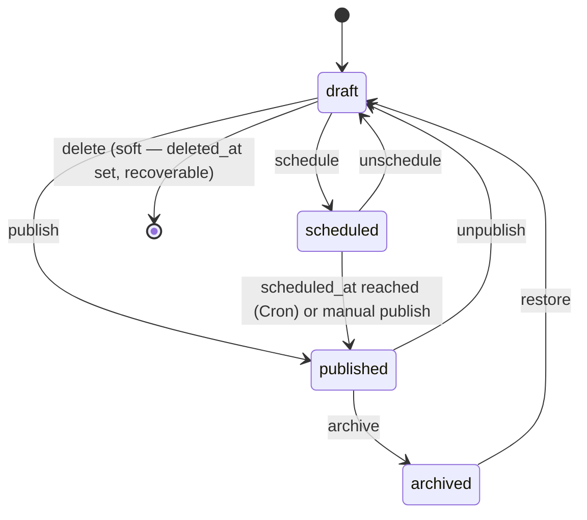

# CMS: Content, Block, and Revision Model

## Block registry

One block type = one Zod schema + one React render component + one entry in
`src/lib/domain/blocks/registry.ts`:

```ts
type BlockDefinition<Config> = {
  key: string                       // matches block_definitions.key
  label: string
  category: 'layout' | 'content' | 'commerce-display' | 'advanced'
  configSchema: z.ZodType<Config>
  defaultConfig: Config
  Editor: React.ComponentType<{ config: Config; onChange: (c: Config) => void }>
  Render: React.ComponentType<{ config: Config }>   // Server Component — public rendering
  requiresPermission?: string       // e.g. Custom HTML requires 'pages.custom_html'
  getHeadingOutline?: (config: Config) => HeadingNode[]  // feeds heading validation
}
```

The registry is the single place adding a new block type touches — the "add
block" picker, the editor, the public renderer, `block_definitions` seed
data, and heading validation all read from it. Validation runs through
`configSchema.parse()` both client-side (immediate feedback) and
server-side (the actual gate — never trust the client's validation alone,
per §43).

### Phase 1 block set (curated, not the full §15 list)

| Block | Notes |
| --- | --- |
| Hero | Headline (rendered as the page's H1 by convention — see heading validation), subhead, up to 2 CTA buttons, background media |
| Rich Text | See "Rich text representation" below |
| Image | Media reference; **alt text is required to save**, not just recommended |
| Feature Grid | Heading + N `{icon/media, title, description}` items |
| Pricing Table | Heading + N `{name, price_label, features[], cta_label, cta_href, highlighted}` — **display copy the admin types in**, not live product data (products don't exist until Phase 5 — see caveat below) |
| Testimonials | N `{quote, author_name, author_role, avatar_media}` |
| FAQ | N `{question, answer}` — also emits `FAQPage` JSON-LD (§27) |
| Stats | N `{value, label}` |
| CTA | Heading, subtext, button |
| Blog Grid | Query of published posts (optionally by category) — proves cross-content-type block rendering now that blog exists |
| Custom HTML | Gated behind a dedicated `pages.custom_html` permission — see "Custom HTML trust model" |

Deferred (registry is designed to add these without restructuring anything
— see [ROADMAP.md](./ROADMAP.md)): Video, Image+Text, Logo Cloud,
Announcement, Timeline, Contact Form, Domain Search, Product Grid, Related
Posts, Trust Badges, Pricing Comparison.

**Pricing Table caveat, stated plainly:** until Phase 5 ships real
`products`/`product_prices` tables, this block's numbers are exactly what
an editor typed into the CMS — real, admin-controlled content, just not
*live-linked* to a billing system. That's an honest, working CMS feature
(editable marketing copy), not a fake integration — the distinction §59
draws. The block schema keeps a reserved-but-unused optional
`linkedProductId` field so wiring it to real data later is additive.

### Rich text representation

Not a WYSIWYG storing raw HTML (arbitrary/malformed HTML is exactly what §4
and §15 say to avoid where a structured alternative exists), and not a
from-scratch custom editor (real scope for one session, and "before
introducing a dependency, check whether the functionality can be
implemented with the existing stack" cuts the other way here — this is a
solved problem). Rich Text blocks store **Markdown** (`config.markdown:
string`), for three concrete reasons:

1. It parses to a real AST (via `remark`), so heading-hierarchy validation
   (§28) inspects actual heading nodes instead of regex-scanning HTML.
2. Rendering through `react-markdown` never touches
   `dangerouslySetInnerHTML` — safe by construction, no sanitizer to get
   wrong.
3. It's still "structured configuration," per §4/§15's own framing, just a
   lighter-weight structure than a full custom node graph — a documented,
   proportionate choice, not a shortcut that reintroduces the HTML-blob
   problem, since the Custom HTML block (below) remains the sole
   deliberate escape hatch.

### Custom HTML trust model

Gated behind `pages.custom_html`, a permission distinct from
`pages.update`, granted only to roles the business owner trusts with
template-level access (`super_admin`/`admin` by default — not
`content_editor`). The block's content is **not** sanitized or stripped —
sanitizing would defeat the block's entire purpose — because the trust
boundary is "who can add this block" (an RBAC/RLS decision, enforced at
save time), not "is this string safe" (which structured blocks handle by
construction). This is the one block where the platform is deliberately
trusting the author, the same way it trusts someone editing a template
file — scoped narrowly, on purpose.

## Draft → published workflow



Editing `page_blocks` never depends on `status` — an editor can always keep
working on the draft copy. What `status` and `published_revision_id`
control is only what the **public** route is allowed to read (enforced by
the RLS policy on `pages`/`page_revisions`, not by application code
choosing not to query draft rows). "Publish" is one transaction: snapshot
`page_blocks` (+ page fields) into a new `page_revisions` row, set
`published_revision_id` to it, set `status='published'`, `published_at =
now()`, write an `audit_logs` row. "Schedule" sets `status='scheduled'` +
`scheduled_at` without touching `published_revision_id` yet; the Cron-driven
`publish_scheduled_content()` function (see
[02-auth.md](./02-auth.md#privilege-escalation--service-role-use)) performs
that same snapshot-and-flip for any due row, and is safe to run more than
once (§11's idempotency requirement) because a page already flipped to
`published` no longer matches its `WHERE status='scheduled' AND
scheduled_at <= now()` selection criteria.

## Revisions

`page_revisions`/`blog_post_revisions` rows are created only by the
publish action (manual or scheduled) — not on every autosave, which would
flood the history with keystroke-level noise. The revision list UI shows
revision number, author, timestamp, and an optional change note; "Compare"
diffs two `blocks_snapshot` values block-by-block (added/removed/changed);
"Restore" copies a past revision's snapshot back into the live
`page_blocks` draft (an editor still has to hit Publish to make it live
again — restoring doesn't silently republish).

## Autosave

The editor is the source of truth while a user is actively editing; the
draft is persisted to `page_blocks` on a **debounced** (~800ms after the
last edit) server action call, not on every keystroke. Two correctness
requirements, both directly addressing §15's "autosave must not cause data
corruption":

- **Stale-response guard.** Each save call carries a client-incremented
  sequence number. If a response arrives for a sequence number older than
  the latest one issued (possible if an earlier save was slow and a later
  edit already triggered a newer save), it's discarded — the UI never lets
  a slow, stale response clobber newer local edits.
- **Explicit save states**, driven by the same call: `idle` → `saving` →
  `saved` (reverts to `idle` after a few seconds) or `error` (with a retry
  action, and the failed edit stays in local state — nothing is silently
  dropped). "Unsaved changes" is shown the instant local state diverges
  from the last-confirmed-saved snapshot, before the debounce even fires.

## Heading validation (§28, enforced at publish, not just suggested)

`validateHeadings(blocks)` walks the block list in order using each block
definition's `getHeadingOutline()` (Hero contributes one H1 by default;
Rich Text contributes whatever heading nodes its Markdown AST actually
has; other blocks contribute none) and reports:

- **Zero H1 or more than one H1 → blocks Publish.** §90's final QA gate
  ("one H1") is treated as a hard constraint, not a dismissible warning —
  the Publish button is disabled with an inline explanation until fixed.
- **Skipped levels** (an H2 followed directly by an H4, say) → a
  non-blocking warning in the SEO/validation panel, per §28's softer
  "warns... where appropriate."
- **Missing image alt text** on any Image block in use → also blocks
  Publish (§12's "must not be silently generated as meaningless
  placeholder text" is enforced by making the empty case a hard stop rather
  than by generating a fake placeholder).

## SEO panel (guidance, not a fake score)

Per page/post: SEO title, meta description, canonical URL, robots
directive, OG title/description/image, plus a deterministic checklist —
focus keyword present in title/slug/first paragraph, meta description
length in the 50–160 range, at least one internal link, every image has
alt text, heading validation results — each shown as pass/warn/fail with
the concrete reason, never collapsed into a single invented "SEO score"
(§69's explicit instruction).
